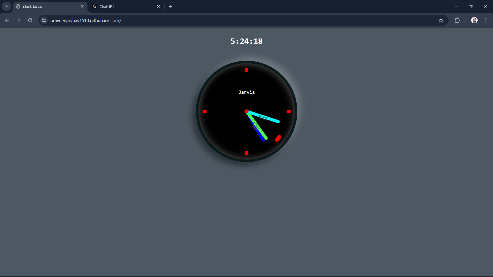

# Jarvis Clock ⏰

A stylish and customizable analog clock built using **HTML**, **CSS**, and **JavaScript**. This clock mimics an advanced look with glowing effects and smooth animations, perfect for any project or personal use.

## 🖥️ Demo

Check out the live version of the clock here: [Jarvis Clock Live](https://praveenjadhav1510.github.io/clock/)


## 🎯 Features

- **Real-time Analog Clock**: Displays the current time with smooth second, minute, and hour hands.
- **Custom Styling**: Unique glowing design with vibrant colors for the clock hands.
- **Digital Time Display**: Displays the current time in digital format above the clock.
- **Responsive Design**: Scales properly across various screen sizes for both desktop and mobile views.

## 💻 Technologies Used

- **HTML5**: Structuring the clock.
- **CSS3**: Styling, animations, and responsiveness.
- **JavaScript**: Logic to control the real-time clock functionality.

## 🛠️ Installation

To run the clock locally:

1. Clone the repository:

   ```bash
   git clone https://github.com/praveenjadhav1510/clock.git
   ```

2. Navigate to the project directory:

   ```bash
   cd clock
   ```

3. Open the `index.html` file in your web browser:

   ```bash
   open index.html
   ```

## 🎨 Customization

- You can easily customize the clock's appearance by modifying the CSS file. Change the color scheme, clock size, or glow effect to suit your preferences.

## 📂 Project Structure

- `/index.html`: HTML file for the clock interface.
- `/style.css`: CSS file that contains all styling for the clock.
- `/script.js`: JavaScript file that controls the clock's functionality.

### Preview 1


#### duble tap to change Theame
### URL https://praveenjadhav1510.github.io/clock
